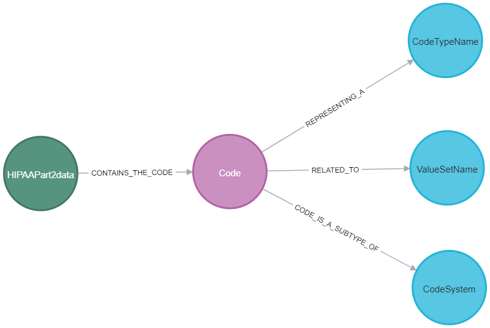
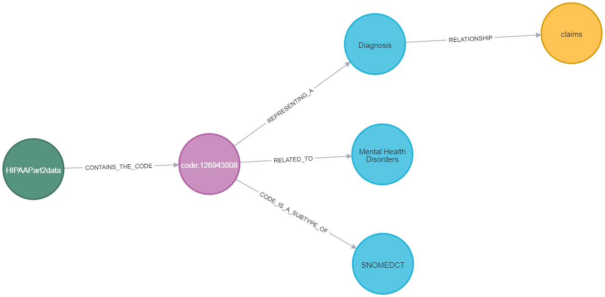
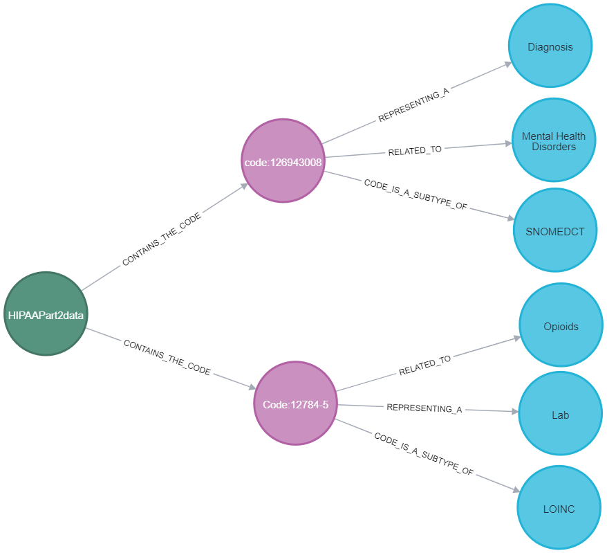

# hie-synthetic-data
This repo contains:
- A set of clincial terms for substance abuse and mental health, mapped into a knowledge graph. These terms are called `Part 2` data, in reference to 42 Code of Federal Regulations Part 2, which is intended to safeguard this kind of sensitive health information. More about HIPAA and Part 2 [here](https://www.hhs.gov/hipaa/for-professionals/special-topics/hipaa-part-2/index.html).
- Scripts to generate synthetic claims data. The data is output in `ttl` format, and can then be linke to the Part 2 graph on SNOMED-CT terms.

## HIPAA Part 2 Knowledge Graph
We classified the NIH value sets to identify clinical terms associated with Substance Abuse and Mental Health as shdown in the table. The complete list of terms is available [here in Excel](https://github.com/Ebiquity/hie-synthetic-data/raw/refs/heads/main/HIPAA%20PART2%20NIH%20CODE%20SET.xlsx).

| **Clinical Terminology** | **Diagnosis** | **Finding** | **History** | **Lab** | **Medication** | **Procedure** | **Total** |
|--------------------------|---------------|-------------|-------------|---------|----------------|---------------|-----------|
| CPT1                   | 0             | 0           | 0           | 0       | 0              | 48            | 48        |
| HCPCS2                 | 0             | 0           | 0           | 0       | 0              | 59            | 59        |
| ICD-10-CM3            | 893           | 0           | 0           | 0       | 0              | 0             | 893       |
| ICD-9-CM4              | 522           | 0           | 0           | 0       | 0              | 0             | 522       |
| LOINC5                 | 0             | 0           | 0           | 1311    | 0              | 0             | 1311      |
| RXNORM6                | 0             | 0           | 0           | 0       | 129            | 0             | 129       |
| SNOMED-CT7            | 1538          | 493         | 17          | 0       | 0              | 0             | 2048      |
| **Grand Total**           | **2953**      | **493**     | **17**      | **1311**| **129**        | **107**       | **5010**  |

[1]: Current Procedural Terminology  
[2]: Healthcare Common Procedure Coding System  
[3]: International Classification of Diseases, 10th Revision, Clinical Modification  
[4]: International Classification of Diseases, 9th Revision, Clinical Modification  
[5]: Logical Observation Identifiers Names and Codes  
[6]: RxNorm  
[7]: Systematized Nomenclature of Medicine - Clinical Terms

We translated this categorization into the knowledge graph:

This results in the ability to link to claims that contain clinical terms:

An example:

## Generating Ad Hoc Claims data in RDF Format
In the `ad-hoc-claims` folder are shell and python scripts for generating data in [Synthea-RDF](https://github.com/leroykim/synthea-rdf/tree/main) format. 
- Shell scripts for generating synthetic data for six hospitals
- Python scripts to convert syntehtic data to RDF format
